# 🌟 Welcome to My Digital Universe

<div align="center">
  
  <!-- Animated Header -->
  
  
  <!-- Dynamic Typing Animation -->
  
  
</div>

---

## 🎭 **About me*

<table>
<tr>
<td width="50%">

### 🌌 **Current Mission**
```typescript
const johnWesley = {
    role: "Full Stack Developer",
    focus: ["Next.js", "Framer Motion", "3D Web Experiences"],
    passion: "Creating Impactful Digital Experiences",
    philosophy: "Function + Form = Impact ✨",
    currentlyLearning: ["Next.js", "Framer Motion", "3D Web"],
    funFact: "Codes to Synthwave & Lo-Fi beats 🎧"
};
```

</td>
<td width="50%">

### 🎯 **Quick Stats**
- 🧠 **Obsessions**: UI/UX Polish & Clean Architecture
- 💻 **Specialty**: Microservices & Interactive Design  
- 🌐 **Portfolio**: [johnwesley.vercel.app](https://johnwesley.vercel.app/)
- 🎨 **Workflow**: Design → Develop → Deploy → Delight
- ⚡ **Debugging Style**: Like solving Rubik's cubes
- 💡 **Core Belief**: Every pixel has a purpose

</td>
</tr>
</table>

---

## 🧰 Tech Stack
<p align="center">
  
</p>

---

## 🏆 **Featured Masterpieces**

<div align="center">

<table>
<tr>
<td width="33%" align="center">


### 🚗 **Car Dealership Platform**
**`Django` `Node.js` `Docker` `React`**

🏗️ Microservices architecture  
⚡ Real-time vehicle listings  
🔄 Scalable dealer management  
📱 Responsive design system

[View Project →](https://github.com/johnwesley755/car-dealership-application)

</td>
<td width="33%" align="center">


### 🎥 **AI Video Generator**
**`React` `Python` `HuggingFace` `AI`**

🤖 NLP text processing  
🎬 Automated video rendering  
✨ Seamless user experience  
🔄 Real-time preview pipeline

[View Project →](https://github.com/johnwesley755/shorts-video)

</td>
<td width="33%" align="center">


### 🤖 **BPO Automation Suite**
**`Express.js` `Firebase` `Python` `NLP`**

🔒 Multi-user authentication  
🧠 Intelligent chatbot system  
📊 Analytics dashboard  
⚙️ Task automation engine

[View Project →](https://github.com/johnwesley755/ai-calling-agent)

</td>
</tr>
</table>

</div>

---

## 📊 **GitHub Analytics**

<div align="center">
<table>
<tr>
<td width="50%">

</td>
<td width="50%">

</td>
</tr>
</table>


</div>

---

## 🎯 **Activity Visualization**

<div align="center">

</div>

---

## 🌐 **Connect & Collaborate**

<div align="center">

<table>
<tr>
<td align="center" width="25%">
<a href="https://linkedin.com/in/john-wesley-6707ab258">

<br/>

</a>
</td>
<td align="center" width="25%">
<a href="https://twitter.com/johnwesley97513">

<br/>

</a>
</td>
<td align="center" width="25%">
<a href="https://instagram.com/john_wesley_755">

<br/>
</a>
</td>
<td align="center" width="25%">
<a href="https://johnwesley.vercel.app/">

<br/>
</a>
</td>
</tr>
</table>

</div>

---

## 💫 **The Creative Process**

```mermaid
graph LR
    A[💡 Ideate] --> B[🎨 Design]
    B --> C[⚡ Develop]
    C --> D[🚀 Deploy]
    D --> E[✨ Delight Users]
    E --> A
    
    style A fill:#FF6B6B,stroke:#ffffff,stroke-width:2px,color:#ffffff
    style B fill:#4ECDC4,stroke:#ffffff,stroke-width:2px,color:#ffffff
    style C fill:#45B7D1,stroke:#ffffff,stroke-width:2px,color:#ffffff
    style D fill:#96CEB4,stroke:#ffffff,stroke-width:2px,color:#ffffff
    style E fill:#FFEAA7,stroke:#ffffff,stroke-width:2px,color:#000000
```

<div align="center">



</div>

---

## 🎮 **Fun Zone**

<div align="center">

### 🐍 **Contribution Snake**
<p align="center">
  
</p>

</div>

---

## 💌 **Parting Words**

<div align="center">
  


</div>

---

<div align="center">
  
</div>
